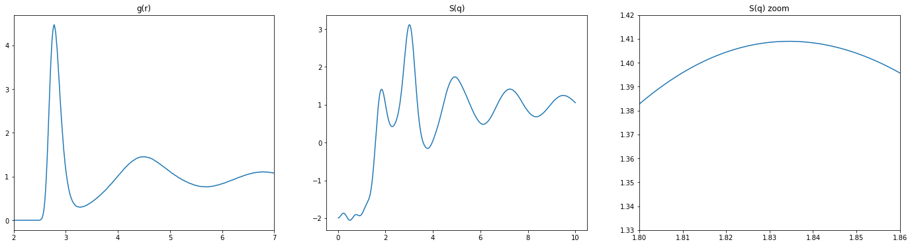
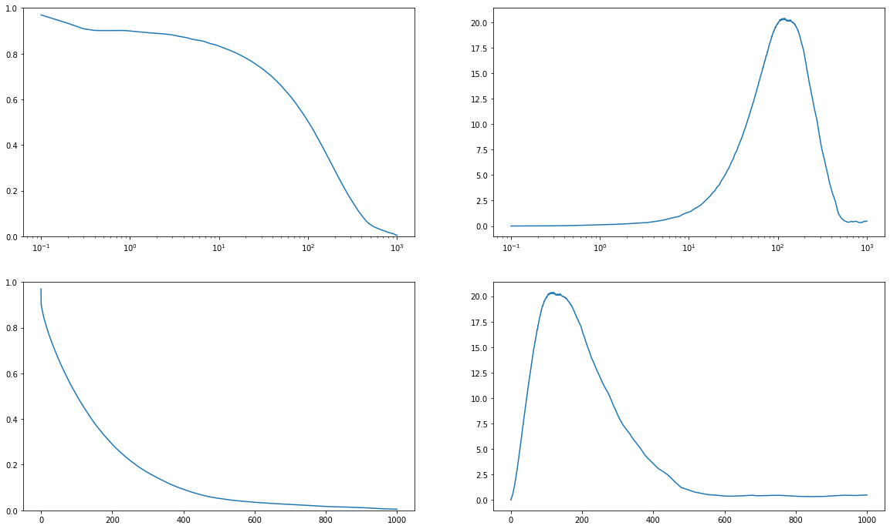

# DynHet

A small package for calculating the self-intermediate scattering function $F(q,t)$ and the dynamical susceptibility $\chi_4(q,t)$

Author: Martin Fitzner, Dec. 2020

## Instructions
For a complete and self-consistent run of everything two things are needed: i) the radial distribution function and ii) the atomic displacements, both at the same thermodynamic state.
Then the follwing stepts yield all quantities:
* Calculate the structure factor $S(q)$ from the radial distribution function $g(r)$. The code provides a function to use the VMD output for $g(r)$, which is just a two column file
* From $S(q)$ typically the position of the first peak is taken for further calculations, denoted as $q_0$
* With $q_0$ and the displacements $F(q_0, t)$ and $\chi_4(q_0,t)$ are calculated

A helper function for reading LAMMPS displacemenst output is provided

## Notes
### Parameters
Typically the simulation for the displacements has to be quite long. The maximum of the $F$ and $\chi_4$ x axis is the simulation time/2. Additionally, a small intervall has to be used to save displacements, this will determine the lower end of the x-axis. Typical values are 0.1 or 0.2 ps for the stride and a total length of about 5 ns but it depends on the time region of interest and the supercooling.

### Results
Once $\chi_4$ is calculated, the time of maximum heterogeneity $t_0$ is where it has its peak. This can be taken for further investigation of dynamical heterogeneity such as iso-configurational analysis (ISOCA). For computational efficiency it can be useful to take $t_0/2$ instead of the full $t_0$.

### ISOCA in LAMMPS
The results from this package are typically used for iso-configurational analysis. Due to constraints used with rigid water models there can be an inconsistency in the velocity initialization (shoutout to the liquid-liquid transition). For this reason the following steps are recommended:
* initialize velocities at random at to the desired temperature $T_0$
* perform 'run 0', this does not advance the time but ensures that the constraints are enforced and veocities are correctly distributed amongst all degrees of freedom
* due to the previous step the total sum of velocities (proportional to the temperature) is now wrong
* hence, rescale (not initialize) the velocities to the desired temperature $T_0$ and the simulation is ready for time integration

## Example


```python
from DynHet import calc_S, calc_F, read_lammps_disp
import numpy as np
import matplotlib.pyplot as plt
```


```python
strFile='./example/250K-0.9466_ox.rdf'
asd = np.genfromtxt(strFile)
r, g = asd[:,0], asd[:,1]
    
q, S = calc_S(r, g, np.arange(0.01,10.0,0.001))

plt.subplot(1,3,1)
plt.plot(r,g)
plt.gca().set_xlim((2,7))
plt.title('g(r)')

plt.subplot(1,3,2)
plt.plot(q,S)
plt.title('S(q)')

plt.subplot(1,3,3)
plt.plot(q,S)
plt.gca().set_xlim((1.8,1.86))
plt.gca().set_ylim((1.33,1.42))
plt.title('S(q) zoom')

plt.gcf().set_size_inches((24,6))
```





```python
strFile = './example/npttest.displacements'  # Note that this file is not provided on git due to its large size

dyn_1 = read_lammps_disp(strFile, 15000)
dyn_1 = dyn_1[:,0::3,:] # consider only oxygens which is every 3rd entry
print(dyn_1.shape)
```

     Frame 4562 of 15000 Frames


```python
# time stride was 0.1ps, q0 was 1.84
t, F, X = calc_F(dyn_1, dt=0.1, q=1.84, maxt=1000, nLagSteps=1, numSteps=2000, nDirections=[1, 1, 1])

plt.subplot(2,2,1)
plt.semilogx(t, np.abs(F))
plt.gca().set_ylim((0,1))

plt.subplot(2,2,2)
plt.semilogx(t, np.abs(X))

plt.subplot(2,2,3)
plt.plot(t, np.abs(F))
plt.gca().set_ylim((0,1))

plt.subplot(2,2,4)
plt.plot(t, np.abs(X))

plt.gcf().set_size_inches((20,12))
```




